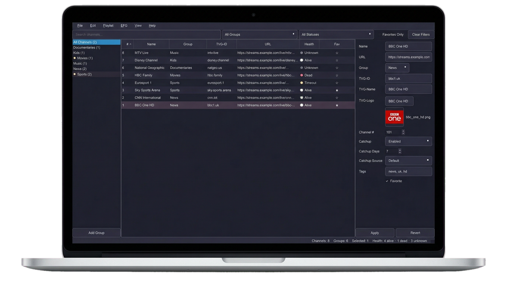
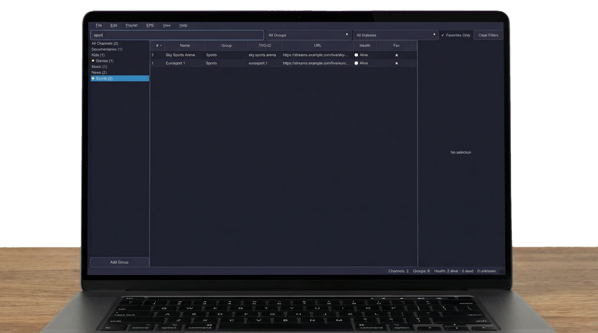
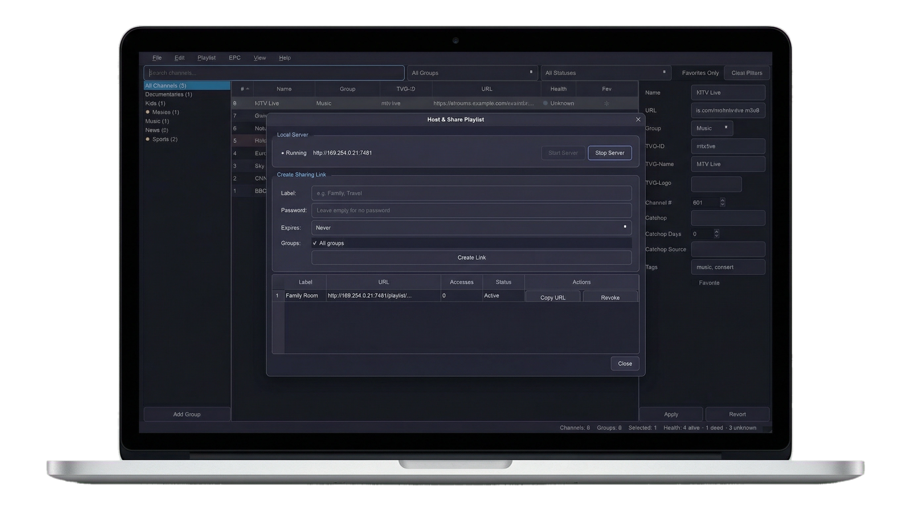
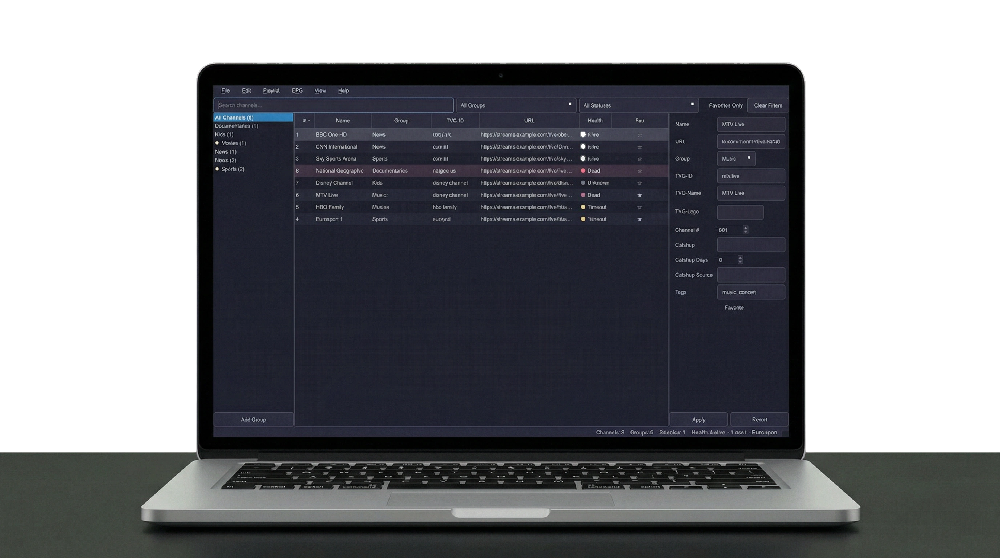

# Fluxo, a dedicated M3U/IPTV playlist manager for power users

<p align="center">
  
</p>

Parse massive M3U lists from file or URL to visually edit channel orders, rename streams, fix broken EPG/XMLTV links, and assign custom logos. Save your optimized playlist locally or host it as a dynamic link for immediate streaming.

<p align="center">
  
  
</p>

Built by [diShine Digital Agency](https://dishine.it).

> **Fluxo is a neutral playlist-management tool for lawful personal and organizational use.**
> It does not bundle, provide, or facilitate access to copyrighted streams or pirate content.

<p align="center">
  
</p>

---

## Features

### Core Playlist Management
- **Create** new playlists from scratch
- **Import** M3U from local files or remote URLs
- **Parse** large playlists robustly (100K+ channels)
- **Edit** channel names, URLs, groups, logos, and EPG IDs
- **Organize** with drag-and-drop reordering, groups, and categories
- **Export** clean M3U/M3U8 files preserving all metadata

### Metadata & EPG
- Full support for #EXTM3U, #EXTINF, tvg-id, tvg-name, tvg-logo, group-title, catchup attributes
- XMLTV/EPG import and management
- Intelligent EPG mapping assistant with fuzzy matching
- EPG mapping validation

### Power User Features
- **Duplicate detection** (exact and fuzzy)
- **Bulk operations**: rename, move, find-and-replace (regex supported)
- **Stream health checking** with background workers
- **Undo/redo** with full history
- **Project files** (.fluxo) for save/resume workflows
- **Autosave** and crash recovery
- **Keyboard shortcuts** for all major actions

### Hosting & Sharing
- **Self-hosted local playlist server** — serve playlists over HTTP on your LAN
- **Shareable links** with optional password protection (PBKDF2)
- **Link expiration** and access tracking
- **Group-filtered sharing** — share a subset of your playlist

### UX
- **Dark and light themes** (Catppuccin-inspired)
- Three-panel layout: Groups | Channels | Details
- Search, filter, and sort
- Multi-select with contextual actions
- Desktop-first native experience (PySide6/Qt)

---

## User Interface

Fluxo uses a three-panel layout optimized for playlist editing workflows:

```
┌──────────────────────────────────────────────────────────────────────┐
│  File  Edit  View  Tools  Help                              ☾ Dark │
├──────────┬───────────────────────────────────┬───────────────────────┤
│          │  🔍 Search... [Filter ▾] [★ Fav] │                       │
│ GROUPS   ├───┬───────────┬───────┬───────────┤  CHANNEL DETAILS     │
│          │ ★ │ Name      │ Group │ URL       │                       │
│ ▸ Sports ├───┼───────────┼───────┼───────────┤  Name: [BBC One    ] │
│ ▸ News   │ ★ │ BBC One   │ News  │ http://…  │  URL:  [http://…   ] │
│ ▸ Movies │   │ CNN Intl  │ News  │ http://…  │  Group: [News  ▾   ] │
│ ▸ Music  │ ★ │ ESPN      │Sport  │ http://…  │  Logo: [http://…   ] │
│ ▸ Kids   │   │ HBO       │Movies │ http://…  │  EPG ID: [bbc1.uk  ] │
│          │   │ Discovery │Docs   │ http://…  │  tvg-name: [BBC 1  ] │
│          │   │ …         │       │           │                       │
├──────────┴───┴───────────┴───────┴───────────┴───────────────────────┤
│  Channels: 1,247  │  Groups: 15  │  Selected: 1  │  ● Server: Off   │
└──────────────────────────────────────────────────────────────────────┘
```

**Panels:**
- **Groups panel** (left) — browse and filter by channel group/category
- **Channel table** (center) — sortable, searchable list with inline editing
- **Detail panel** (right) — edit all metadata for the selected channel

---

## Sharing Workflow

Host your playlist on the local network so other devices can stream from it:

```
  ┌──────────┐         ┌──────────────────┐         ┌──────────┐
  │  Fluxo   │         │  Playlist Server │         │  Client  │
  │  Desktop │────────▸│  (localhost:7481) │◂────────│  Device  │
  └──────────┘ create  └──────────────────┘  GET    └──────────┘
       │        link          │                          │
       │                      │  /playlist/<token>       │
       │                      │◂─────────────────────────│
       │                      │                          │
       │                      │  ── auth? ──▸            │
       │                      │  ◂─ password ─           │
       │                      │                          │
       │                      │  200 OK (M3U content)    │
       │                      │─────────────────────────▸│
       │                      │                          │
```

**Steps:**
1. Open **Tools → Sharing** in Fluxo
2. Click **Create Link** — optionally set a password, expiry, or group filter
3. Copy the generated URL (e.g. `http://192.168.1.42:7481/playlist/abc123…`)
4. Paste the URL into any IPTV player on your network

---

## Keyboard Shortcuts

| Shortcut | Action |
|----------|--------|
| `Ctrl+N` | New playlist |
| `Ctrl+O` | Open file |
| `Ctrl+S` | Save project |
| `Ctrl+Shift+S` | Save as |
| `Ctrl+E` | Export M3U |
| `Ctrl+I` | Import M3U |
| `Ctrl+Z` | Undo |
| `Ctrl+Shift+Z` | Redo |
| `Ctrl+F` | Search / find |
| `Ctrl+H` | Find and replace |
| `Ctrl+A` | Select all |
| `Ctrl+D` | Duplicate detection |
| `Ctrl+G` | Go to group |
| `Delete` | Delete selected |
| `F5` | Refresh / check streams |

---

## Installation

### From Source

```bash
# Clone the repository
git clone https://github.com/diShine-digital-agency/fluxo.git
cd fluxo

# Create virtual environment
python -m venv .venv
source .venv/bin/activate  # macOS/Linux
# .venv\Scripts\activate   # Windows

# Install
pip install -e ".[dev]"

# Run
python -m fluxo
```

### Desktop Builds

Pre-built installers for macOS and Windows are available on the [Releases](https://github.com/diShine-digital-agency/fluxo/releases) page.

To build locally:
```bash
pip install pyinstaller
python scripts/build.py
```

---

## Tech Stack

| Component | Technology |
|-----------|-----------|
| Language | Python 3.11+ |
| UI Framework | PySide6 (Qt 6) |
| HTTP Client | httpx |
| XML Parsing | lxml |
| Encoding Detection | chardet |
| Packaging | PyInstaller |
| Testing | pytest + pytest-qt |

---

## Project Structure

```
src/fluxo/
├── models/          # Typed data models (Channel, Playlist, EPG, Project, Collection)
├── parsers/         # M3U and XMLTV parsers
├── services/        # Business logic (validation, dedup, export, EPG mapping, sharing)
├── server/          # Local HTTP playlist server and shared-link management
├── ui/              # PySide6 widgets and dialogs
│   └── widgets/     # Reusable UI components
│       └── dialogs/ # Import, export, bulk edit, sharing, settings dialogs
├── persistence/     # Settings and autosave
├── app.py           # Application entry point
└── __main__.py      # Module entry point
```

---

## Testing

```bash
# Standard (macOS / Windows)
pytest

# Linux / headless CI
QT_QPA_PLATFORM=offscreen pytest
```

---

## Documentation

- [Product Discovery Report](docs/PRODUCT_DISCOVERY.md)
- [Architecture](docs/ARCHITECTURE.md)
- [Roadmap](docs/ROADMAP.md)
- [Changelog](CHANGELOG.md)
- [Contributing](CONTRIBUTING.md)
- [Security](SECURITY.md)
- [Code of Conduct](CODE_OF_CONDUCT.md)

---

## License

MIT License — see [LICENSE](LICENSE) for details.

Copyright (c) 2026 [diShine Digital Agency](https://dishine.it)

---

## About diShine

[diShine](https://dishine.it) is a creative tech agency based in Milan. We build tools for digital consultants, help businesses with AI strategy and MarTech architecture, and open-source the things we wish existed.

- Web: [dishine.it](https://dishine.it)
- GitHub: [github.com/diShine-digital-agency](https://github.com/diShine-digital-agency)
- Contact: kevin@dishine.it
